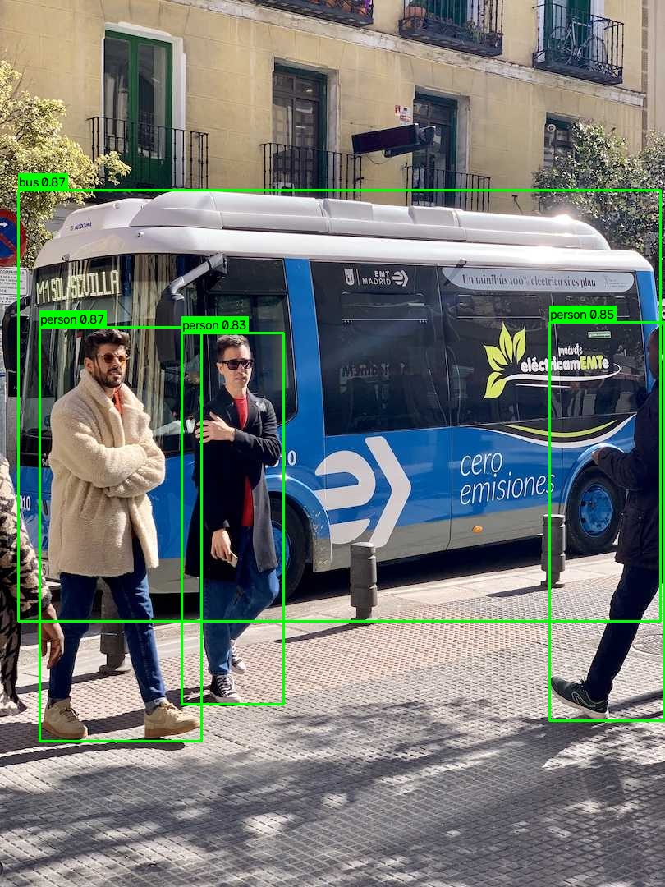

# Camera Object Detection

[](https://github.com/conchocon154/object-detection/actions/workflows/ci.yml)
[](LICENSE)

Real-time object detection from a webcam, video file, or image using [Ultralytics YOLO](https://docs.ultralytics.com/) and OpenCV.



## Project structure

```
object-detection/
├── main.py            # entry point: capture → detect → display loop
├── config.py          # all tunable settings (model, thresholds, camera)
├── requirements.txt
├── src/
│   ├── camera.py      # OpenCV camera wrapper
│   └── detector.py    # YOLO inference + frame annotation
└── README.md
```

## Setup

```bash
cd object-detection
python3 -m venv .venv
source .venv/bin/activate
pip install -r requirements.txt
```

The YOLO weights (`yolov8n.pt`, ~6 MB) download automatically on first run.

## Run

```bash
python main.py                       # default webcam
python main.py --source 1            # a specific webcam index
python main.py --source clip.mp4     # a video file
python main.py --source photo.jpg    # a single image
python main.py --source clip.mp4 --save out.mp4 --no-show   # headless, write to file
```

Press **`q`** in the video window to quit (live/video mode).

## Configuration

Edit `config.py` to change behavior:

- `MODEL_NAME` — swap `yolov8n.pt` for `yolov8s/m/l/x.pt` (larger = more accurate, slower).
- `CONFIDENCE_THRESHOLD` — raise to reduce false positives.
- `CLASS_FILTER` — e.g. `[0]` to detect people only ([COCO class ids](https://docs.ultralytics.com/datasets/detect/coco/)).
- `CAMERA_INDEX` — change if you have multiple cameras.

## Testing

A headless smoke test runs the full detect → annotate pipeline on a committed
fixture image (no camera needed):

```bash
python tests/smoke_test.py
```

This is the same check CI runs on every push and pull request.

## Notes

- On macOS, grant camera permission to your terminal (System Settings → Privacy & Security → Camera) the first time you run it.

## License

Released under the [MIT License](LICENSE).
